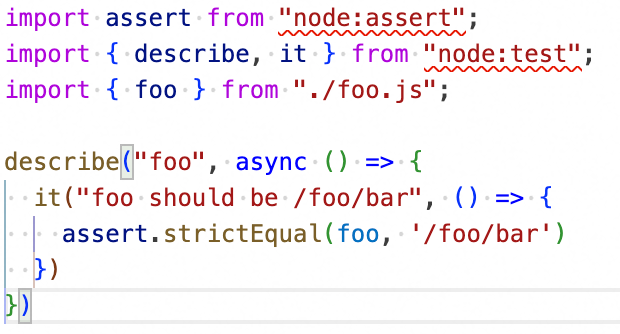

# bug-report

## Environment

- TypeScript: v5.7.2
- VSCode: Latest
- Node: v22.12.0
- pnpm: 9.15.0

## Steps to Reproduce

1. Clone this repo and checkout `typescript/should_load_nearest_node_modules_types_bug` branch.
2. Open this project using VSCode.
3. Run `pnpm i` in the root of this project.
4. Refresh VSCode (close all tabs).
5. Open `./packages/foo/src/foo.spec.ts` file.

## Expected Behavior

No errors in VSCode editor.

## Actual behavior

See the screenshot above. There are some importing errors.

## Extra Information

Run `pnpm --filter foo uninstall @types/node && pnpm install @types/node -Dw` and then re-open the `./packages/foo/src/foo.spec.ts` file. The errors disappear.
